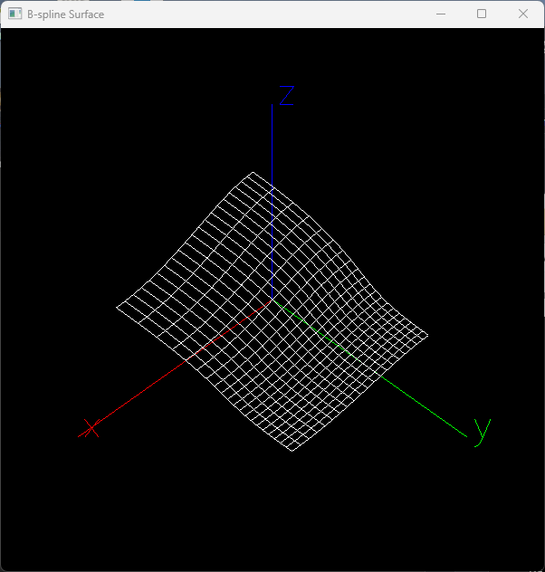

# BsplineSurface
Display B-spline surface using OpenGL

## Usage

- drag with left mouse button: rotation

- drag with right mouse button: translation

- scroll up/down: zoom in/out

- r/R: reset to isometric view

## Development tools

- Microsoft Visual Studio Community 2022 (64-bit) - Preview
Version 17.4.0 Preview 4.0 (C++20)

- OpenGL via vcpkg

## Screenshot

